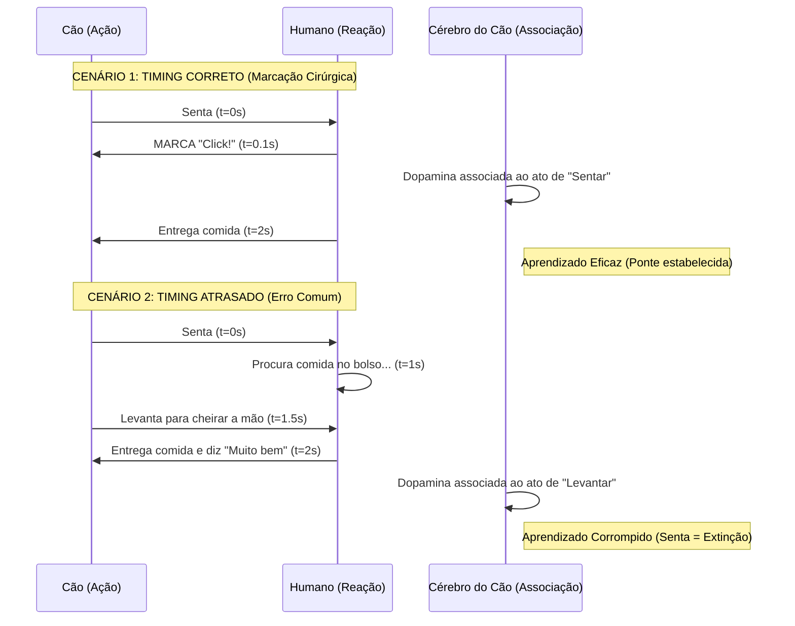
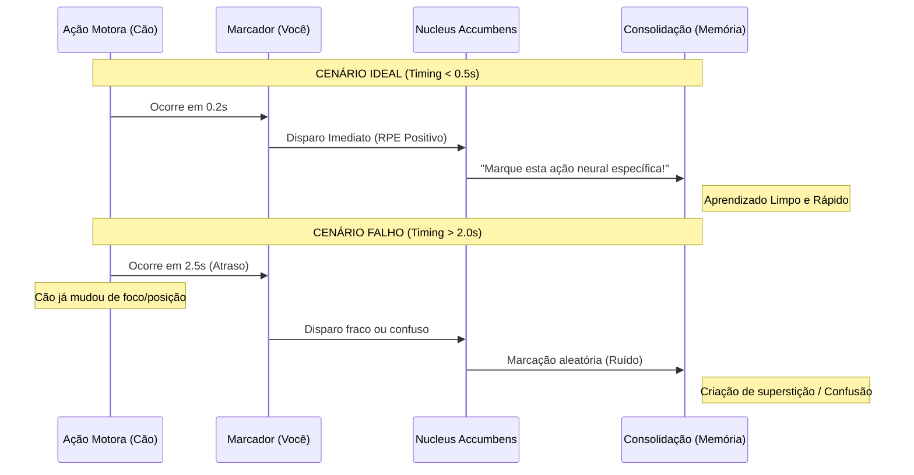
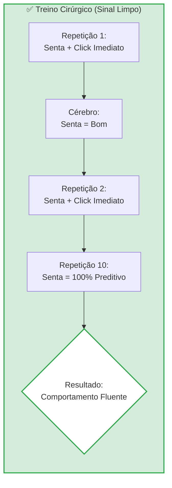
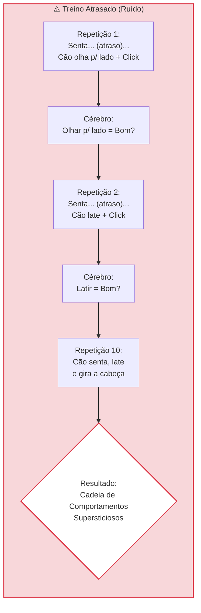
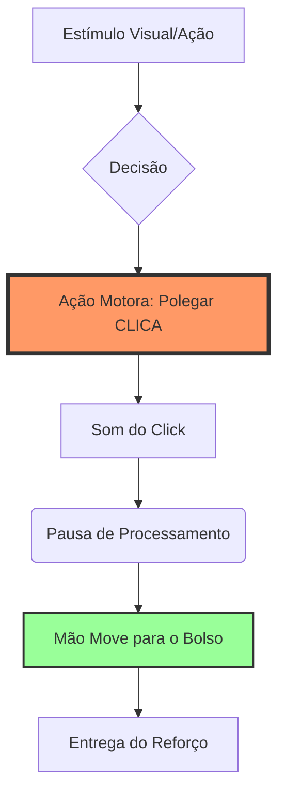

# A Importância do Timing no Adestramento: O Custo Biológico do Atraso

## 1. A Ilusão da "Gratidão Tardia"

No adestramento técnico, intenção não vale nada; apenas a mecânica importa. Um dos maiores erros cometidos por treinadores amadores e tutores é acreditar na **transferência de informação retroativa**.

O mito resume-se a esta crença: *"Se eu der o petisco agora, ele sabe que é porque ele sentou há 5 segundos."*

**Não, ele não sabe.** Biologicamente, isso é impossível. O cérebro canino não processa a relação causa-efeito dessa forma linear narrativa. Se você perde o *timing*, você não está recompensando o comportamento alvo; você está recompensando o vácuo, ou pior, um comportamento indesejado aleatório.

### 1.1 O Problema da Atribuição de Crédito

Na Ciência da Computação e na Etologia Cognitiva, chamamos isso de **Credit Assignment Problem**. O cérebro do animal precisa calcular instantaneamente: *"Qual das minhas últimas 50 ações motoras fez esse prêmio aparecer?"*

A resposta do cérebro é sempre a ação **mais imediata** (contígua) ao prêmio.

Considere o cenário clássico de um "Senta" mal cronometrado:

1. Comando "Senta".
2. Cão encosta a bunda no chão (Comportamento Alvo).
3. Humano demora 2 segundos para pegar o petisco.
4. Nesse intervalo, o cão levanta a pata ou olha para o lado.
5. O prêmio chega na boca do cão.

**Resultado Técnico:** Você acabou de ensinar o cão a *olhar para o lado*, e não a sentar. O "sentar" tornou-se irrelevante para a equação de ganho.

!!! warning "A Regra dos 0.5 a 1.0 Segundo"
    Estudos sobre condicionamento operante mostram que a curva de aprendizado cai drasticamente conforme o intervalo entre a resposta (ação) e o reforço aumenta.

!!! quote "[Delay of reinforcement in instrumental learning (Grice, 1948) - Um clássico que estabeleceu o gradiente de atraso.](https://www.sciencedirect.com/science/chapter/bookseries/abs/pii/S0065240708604814)"
    A "janela de ouro" para a marcação (o *click* ou "Isso!") é de **0 a 0.5 segundos**. Passou de 1 segundo, você entrou na zona de **reforço acidental**.

### 1.2 O Mecanismo da "Câmera Fotográfica"

Para entender a função da marcação, abandone a ideia de "dar um prêmio". Pense em **tirar uma foto**.

O marcador (clicker ou voz) serve para **congelar o tempo**. Ele diz ao cérebro do cão: *"A imagem exata do que seu corpo estava fazendo neste milissegundo é o que gerou o pagamento."*

Se você tira a "foto" (marca) depois que o cão já se moveu, a foto sai borrada ou focada no objeto errado. O cão nunca entenderá a mecânica do exercício se as fotos (feedbacks) estiverem sempre atrasadas.

### 1.3 A Analogia do Salário Aleatório

Imagine que você trabalha em um escritório.

1. Você entrega um relatório brilhante na terça-feira. Ninguém diz nada.
2. Na quinta-feira, você está coçando o nariz e seu chefe entra, te dá R$ 100,00 e diz "Parabéns!".
3. Na semana seguinte, você tenta fazer o relatório de novo. Nada acontece.
4. Você coça o nariz. Nada acontece.
5. Você está tomando café, o chefe entra e te dá R$ 100,00.

O que acontece com seu comportamento? Você entra em um estado de **ansiedade e superstição**. Você começa a tentar adivinhar padrões onde eles não existem. É exatamente isso que acontece com um cão treinado sem timing preciso. Ele se torna um "caça-níqueis" de comportamentos, tentando tudo freneticamente, mas sem entender a regra do jogo.

!!! danger "Comportamento Supersticioso"
    Skinner demonstrou isso com pombos em 1948. Ao entregar comida em intervalos aleatórios (sem conexão com a ação), os pombos desenvolveram rituais bizarros (rodar a cabeça, bater as asas), acreditando que *aquilo* causava a comida.

!!! quote "[Superstition in the Pigeon - B.F. Skinner](https://psychclassics.yorku.ca/Skinner/Pigeon/)"
    No treino de cães, o atraso na marcação cria cães que latem, pulam ou giram antes de obedecer, pois acreditam que esse ritual faz parte do comando.

*Figura 1.1: O custo da incerteza. A esquerda, contingência clara. A direita, o reforço intermitente gera ansiedade e superstição (o efeito caça-níqueis).*

---

## 2. A Ciência: O Mecanismo (Hard Science & ABA)

Vamos abandonar a psicologia de botequim e falar de biologia. O cérebro do cão não opera por "vontade de agradar"; ele opera por **economia de energia** e **maximização de recursos**.

O adestramento eficiente não é uma conversa entre duas almas; é a manipulação precisa de variáveis ambientais para alterar a probabilidade de um comportamento futuro. Para isso, precisamos entender dois pilares da Análise do Comportamento (ABA) e um mecanismo neurofisiológico crítico.

### 2.1 Contiguidade vs. Contingência: A Engenharia do Aprendizado

Muitos treinadores confundem estes dois termos. A diferença é o que separa um cão operante de um cão caótico.

1. **Contiguidade (O "Quando"):** Refere-se à proximidade temporal entre dois eventos. Se o evento A (sentar) e o evento B (click) ocorrem com um intervalo de 0.5s, há alta contiguidade.
2. **Contingência (O "Se-Então"):** Refere-se à relação de dependência. O evento B (click/comida) *só* acontece *se* o evento A (sentar) ocorrer.

Para o aprendizado ocorrer, **ambas** devem existir.

!!! warning "O Interruptor Quebrado"
    Imagine um interruptor de luz.

    * **Alta Contiguidade/Alta Contingência:** Você aperta, a luz acende instantaneamente. (Aprendizado: "Apertar gera luz").
    * **Baixa Contiguidade:** Você aperta, espera 10 segundos, a luz acende. (Conclusão: "O sistema está com defeito/lag").

    Se você clica atrasado, você é um interruptor com defeito para o seu cão. Ele continuará apertando (comportamento), mas sem confiança na mecânica do sistema.

### 2.2 O Marcador (Ponte): Reforçador Secundário Condicionado

O "Clicker" ou a palavra de marcação ("Yes"/"Isso") não é apenas um barulho. Tecnicamente, ele é um **Estímulo Neutro** que foi emparelhado via Condicionamento Clássico (Pavlov) com um **Estímulo Incondicionado** (Comida).

Após o emparelhamento, ele se transmuta em um **Reforçador Secundário Condicionado**.

#### A Função "Bridge" (Ponte)

A biologia impõe um limite físico: é impossível entregar comida na boca do cão no exato milissegundo em que ele realiza uma ação complexa à distância. O Marcador serve para preencher o *gap* temporal entre a ação e o consumo.

*Figura 2.1: O marcador "congela" o comportamento no tempo, permitindo o atraso na entrega do reforço primário.*

Se o marcador for acionado no *timing* correto (contiguidade < 0.5s), o tempo que leva para entregar a comida (latência de entrega) torna-se irrelevante para a associação, desde que a comida chegue.

### 2.3 RPE: O Erro de Predição de Recompensa (A Química da Dopamina)

Aqui entramos na *Hard Science*. Por que o timing é tão vital? Por causa de um mecanismo descoberto pelo neurocientista Wolfram Schultz, chamado **Reward Prediction Error (RPE)**.

Ao contrário do senso comum, a dopamina não é liberada apenas no *consumo* da recompensa. Em um cérebro que aprendeu a regra, o pico de dopamina migra do "recebimento" para a "antecipação".

**O Processo Neuroquímico:**

1. **Fase de Aprendizado:** Dopamina sobe quando a comida chega.
2. **Fase Condicionada:** Dopamina dispara no **sinal** (Click), prevendo a recompensa.

Se o seu timing é ruim, você falha em gerar esse pico de dopamina associativo. O cérebro do cão monitora a diferença entre o que ele *esperava* acontecer e o que *realmente* aconteceu.

!!! info "[A Neural Substrate of Prediction and Reward - Wolfram Schultz, et al. (Science)](https://www.science.org/doi/10.1126/science.275.5306.1593)"
    Wolfram Schultz demonstrou que os neurônios dopaminérgicos no mesencéfalo codificam o erro de predição.

* **Click Exato:** Pico de dopamina imediato (Sinal de "Sucesso!"). O comportamento é fortalecido.
* **Click Atrasado/Ausente:** Queda na atividade dopaminérgica (Sinal de "Fracasso/Erro"). O comportamento entra em extinção.

### 2.4 O Diagrama do Fracasso vs. Sucesso

O diagrama abaixo ilustra o que acontece no nível do processamento de informação quando o timing varia.

### 2.5 A Janela de Latência Cerebral

Estudos de neurofisiologia indicam que a janela para associar um estímulo sensorial (som do click) a uma resposta motora (ação muscular) antes que a memória de curto prazo (working memory) seja sobrescrita por novos dados sensoriais é extremamente curta.

* **0.0s - 0.5s:** Zona de Ouro. Associação quase instantânea.
* **0.5s - 1.0s:** Zona Aceitável. Aprendizado ocorre, mas mais lento.
* **> 1.0s:** Zona de Degradação. O cérebro começa a processar estímulos ambientais concorrentes (cheiros, sons, coceiras).

!!! danger "O Custo do Atraso"
    Treinar fora da janela de latência não é apenas "menos eficiente"; é ativamente estressante. O cão tenta resolver um quebra-cabeça onde as peças mudam de forma aleatória. Isso eleva os níveis de cortisol, bloqueando a neuroplasticidade necessária para o aprendizado.

!!! quote
    *Um cão confuso não aprende; ele apenas sobrevive à sessão de treino.*

---

## 3. Tabela Comparativa: Precisão vs. Ruído

Na engenharia de comportamento, não existe "meio certo". Existe o sinal limpo e existe o ruído.

Quando analisamos os dados de aquisição de comportamento, a diferença entre um treinador que marca em 0.5s e um que marca em 2.0s não é apenas uma questão de velocidade; é uma mudança fundamental na **neuroquímica** do animal.

Abaixo, apresento a dissecação técnica do que ocorre em dois cenários distintos de *timing*.

### 3.1 O Abismo Operante (Data Breakdown)

| Variável | Timing Cirúrgico (< 0.5s) | Timing Atrasado/Amador (> 2.0s) |
| --- | --- | --- |
| **Foco da Associação** | **Ação Motora Específica** (Ex: O músculo glúteo toca o chão). | **Contexto Ambiental/Aleatório** (Ex: Cheiro da grama, olhar para o lado, coceira). |
| **Neurotransmissor Dominante** | **Dopamina (Via Mesolímbica)**. Pico preciso de antecipação e prazer. | **Cortisol & Noradrenalina**. Mistura de excitação com ansiedade e frustração. |
| **Interpretação do Cão** | "Eu controlo o click." (Empoderamento/Agência). | "O click acontece aleatoriamente." (Loteria/Sorte). |
| **Curva de Aquisição** | Exponencial. O comportamento é fixado em poucas repetições. | Plana ou Errática. O animal oscila entre acertos e erros sem padrão. |
| **Estabilidade Emocional** | Alta. O cão está calmo e focado na tarefa (Flow). | Baixa. O cão vocaliza, morde a guia ou oferece comportamentos frenéticos (Frustração). |
| **Fenômeno Resultante** | **Lei do Efeito (Thorndike):** O comportamento alvo aumenta de frequência. | **Comportamento Supersticioso (Skinner):** Rituais bizarros são criados e mantidos. |

### 3.2 Visualizando o Ruído de Sinal

Para entender o dano causado pelo atraso, utilizaremos a Teoria de Detecção de Sinal.

Imagine que o comportamento correto (Senta) é um sinal de rádio. O ambiente (cheiros, sons, movimentos) é a estática.

* **Timing Correto:** Amplifica o sinal do "Senta" em 100x.
* **Timing Atrasado:** Amplifica a estática.

O diagrama abaixo ilustra a divergência de aprendizado em uma sessão de 10 repetições.

### 3.3 A Falácia da "Inteligência"

É comum ouvir tutores e treinadores ruins dizerem: *"Esse cão é teimoso"* ou *"Ele é burro, demora para aprender"*.

Ao analisar a tabela acima, a conclusão técnica é óbvia: **O cão não é burro. O professor é que gagueja.**

Se você fornece feedback atrasado, você está efetivamente mentindo para o cão sobre o que ele fez certo. O cão que aprende "errado" com timing atrasado é, na verdade, um cão **altamente inteligente**: ele aprendeu *exatamente* o que você marcou (o erro), e não o que você *queria* marcar.

!!! danger "Risco de Agressão Redirecionada"
    Em cães com *drive* alto (Malinois, Border Collies), a ambiguidade gerada pelo *timing* ruim causa um acúmulo de frustração tão alto que pode resultar em **agressão redirecionada** contra o condutor.

!!! quote
    O cão morde a manga, a guia ou a mão não por agressividade, mas como uma descarga motora de estresse causado pela falta de clareza na comunicação.

*Figura 3.1: A relação inversa entre latência do reforço e taxa de aquisição. Note que após 1.0s, a eficiência cai para níveis próximos ao acaso.*

!!! quote "A Regra de Ouro do Behaviorista"
    Se o comportamento não está evoluindo, pare de treinar o cão. Filme a si mesmo. Em 99% dos casos, o atraso entre a ação do cão e o seu movimento muscular de marcar é a causa raiz da estagnação.

---

## 4. How-To: Calibrando o Biorrobô (O Humano)

O maior obstáculo no adestramento moderno não é a capacidade cognitiva do cão, é a **latência motora do primata** que segura a guia.

Biologicamente, o ser humano tem um tempo de reação visual médio de **250 milissegundos** (0.25s). Adicione a isso o tempo de processamento de decisão e a execução muscular do polegar, e você facilmente ultrapassa a marca de 0.5s. Para um cão, que processa movimento visual muito mais rápido que nós (frequência de fusão de cintilação mais alta), você se move em "câmera lenta".

Antes de tentar operar um organismo vivo complexo, você precisa dominar a mecânica básica. Se você não consegue clicar no tempo certo com um objeto inanimado, você não tem o direito de exigir precisão do seu cão.

### 4.1 O Princípio da Dissociação Motora (Click  Food)

O erro mecânico número #1 é o **"Reaching" (O braço da comida)**.
Muitos treinadores movem a mão em direção ao bolso de petiscos *simultaneamente* ou até *antes* de clicar.

**O Problema Científico:**
Isso cria um fenômeno de **Bloqueio (Blocking Effect - Kamin, 1969)**. O movimento da mão é um sinal visual muito maior e mais saliente que o som do click. O cão aprende a olhar para sua mão, e o click torna-se ruído de fundo irrelevante.

!!! danger "A Regra Sagrada"
    **CLICK -> PAUSA (0.5s) -> MÃO NA COMIDA**

    A mão que entrega a comida deve estar **morta** (imóvel) no momento do click. Se ela se mover um milímetro antes ou durante o som, você falhou. O click dispara a mão, não o contrário.

*Figura 4.1: O erro do "Reaching". Na esquerda, a mão antecipa o click (contaminando o sinal). Na direita, a mão aguarda o processamento.*

### 4.2 Exercício 1: A Queda Livre (Calibragem Física)

A gravidade é constante (9.8 m/s²). Ela não te engana, não tem dias ruins e não tenta te manipular. É o parceiro de treino perfeito.

**O Setup:**

1. Fique em pé, segure uma bola de tênis na altura do ombro.
2. Segure o clicker (ou prepare o marcador verbal) na outra mão.
3. Solte a bola.

*Figura 4.2: O treino solitário. Seu objetivo é sincronizar o som com o impacto visual/auditivo da bola.*

**A Missão:**
Clicar no **exato milissegundo** em que a bola toca o chão.

**Avaliação de Resultados:**

* **Som "THUD-CLICK":** Você está atrasado. O cão já teria mudado de comportamento.
* **Som "CLICK-THUD":** Você está antecipando (ansiedade). Você marcaria um comportamento que ainda não terminou.
* **Som Único (Sincronia):** Perfeito.

!!! quote "Critério de Aprovação"
    Faça séries de 10 repetições. Você só está autorizado a treinar com o cão quando conseguir **10/10** de precisão perfeita.

!!! warning "Variação Hardcore"
    Jogue a bola contra a parede. Clique quando ela tocar a parede. A velocidade é maior, exigindo reflexos mais agudos.

### 4.3 Exercício 2: O Jogo do Caos (Estimulo Visual Aleatório)

Cães são imprevisíveis. Treinar com a gravidade é fácil porque é previsível. Agora precisamos treinar sua reação a eventos aleatórios.

**O Setup:**

1. Sente-se no sofá. Cão em outro cômodo.
2. Ligue a TV em um canal de notícias ao vivo ou esporte rápido (tênis/ping-pong).
3. Defina um "Comportamento Alvo" arbitrário.

**Exemplos de Alvos:**

* Toda vez que a câmera mudar de ângulo (Corte de cena).
* Toda vez que o apresentador piscar.
* Toda vez que a bola de tênis tocar na raquete.

**A Missão:**
Capturar o evento visual fugaz com seu clicker. Isso treina seu córtex visual para enviar o sinal ao motor com latência mínima, ignorando o resto do "ruído" (áudio da TV, cores, legendas).

!!! info "Fato Psicofísico [(Lei de Hick)](https://pt.wikipedia.org/wiki/Lei_de_Hick)"
    O tempo de reação aumenta logaritmicamente com o número de escolhas possíveis. No início, foque em UM gatilho (apenas cortes de câmera). Não tente marcar cortes E piscadas ao mesmo tempo, ou seu timing vai degradar. Treine o foco seletivo.

### 4.4 Exercício 3: Propriocepção e Entrega (Delivery)

Onde você entrega a recompensa é tão importante quanto quando você clica. A entrega da comida pode ser usada para "resetar" o cão ou para mantê-lo na posição.

**Drill de Mecânica:**

1. Coloque um alvo (pode ser um post-it) na parede.
2. Toque o post-it com o dedo (simulando o focinho do cão).
3. Clique.
4. Retire a mão do post-it e leve à sua "bolsa de petiscos" imaginária.
5. Leve a "comida" de volta exatamente ao local do post-it.

**Erro Comum:**
Clicar e entregar a comida longe do alvo. Se o cão tem que sair da posição "Senta" para comer, você acabou de punir a posição estática e premiar o movimento de quebra.

---

## 5. Diagnóstico de Falhas Operacionais

No laboratório, chamamos a análise de erros de "tratamento de dados discrepantes". No campo de treino, chamamos de "descobrir onde você estragou o processo".

Errar o *timing* é humano. O problema não é o erro isolado, é a **consistência no erro**. Se você repete a falha sistematicamente, você não está treinando; você está criando um padrão de comportamento indesejado enraizado na confusão.

Aqui classificaremos os erros estatísticos comuns que destroem a contingência do aprendizado.

*Figura 5.0: A Matriz de Contingência. O adestramento limpo busca maximizar os Quadrantes Verdes (Acerto/Rejeição Correta) e zerar os Vermelhos.*

### 5.1 Erro Tipo I: Falso Positivo (A Antecipação Ansiosa)

Ocorre quando o treinador marca (clica) *antes* do critério comportamental ser plenamente atingido. É o erro do ansioso.

**O Cenário:** Você está treinando o comando "Senta". O cão começa a dobrar os joelhos traseiros. Você clica *enquanto* ele está descendo, mas a bunda ainda não tocou o chão.

**A Consequência Técnica:**
Você acabou de alterar o critério de "Bunda no chão" para "Agachamento leve". O cão aprende que o esforço incompleto paga o mesmo salário. Biologicamente, o cérebro opta sempre pela Lei do Menor Esforço. Se "quase sentar" paga, ele nunca mais vai sentar de verdade.

!!! danger "Degradação de Critério"
    A antecipação é o câncer da precisão. Ao clicar antes da finalização, você ensina o cão a abortar a missão no meio do caminho para buscar o prêmio.

**Resultado:** Cães que "hoveram" (pairam) sobre o chão mas nunca encostam, ou cães que rompem o "Fica" antes da hora.

### 5.2 Erro Tipo II: Falso Negativo (A Omissão)

Ocorre quando o cão executa o comportamento perfeito, mas o treinador está distraído, lento ou julgando demais, e **não clica**.

**O Cenário:** O cão oferece um contato visual perfeito de 3 segundos. Você demora 4 segundos processando se aquilo foi bom o suficiente. O cão desvia o olhar. Você perdeu a janela.

**A Consequência Técnica:**
Isso gera o que chamamos de **Burst de Extinção**. Quando uma ação que costumava gerar recompensa falha em gerar recompensa, a primeira reação do animal não é desistir, é aumentar a intensidade ou variabilidade (frustração).

Se você omite cliques sistematicamente em acertos, o cão começa a latir, pular ou morder a guia, tentando "ligar" a máquina de petiscos que parece quebrada.

### 5.3 O Marcador Envenenado (Poisoned Cue)

Este é um erro estrutural grave. Acontece quando o som do clicker (ou a palavra "Muito Bem") perde seu valor preditivo de recompensa positiva e passa a prever eventos neutros ou aversivos.

**Causas Comuns:**

1. **Click sem Pagamento:** Clicar para chamar a atenção do cão e não dar comida. (Violação do contrato).
2. **Click Trap (Armadilha):** Clicar para o cão vir até você e, quando ele chega, você dá banho, corta a unha ou prende na caixa de transporte.

**O Resultado:**
O som do clicker passa a ativar a amígdala (medo/suspeita) em vez do núcleo accumbens (expectativa de prazer). O cão ouve o click e hesita ou foge.

!!! warning "O Estudo de Pavlov Reverso"
    Se o Estímulo Condicionado (Click) for seguido consistentemente por um estímulo aversivo, ele se torna um **Punitivo Condicionado**.

*Figura 5.1: Associações opostas. O clicker deve prever dopamina, não cortisol. Se o cão hesita, o sinal está envenenado.*

Se o seu cão foge ou abaixa as orelhas quando vê o clicker, jogue a ferramenta no lixo. Ela está "queimada". Compre um novo com som diferente e recomece a associação do zero.

### 5.4 Over-clicking (A Metralhadora)

Clicar múltiplas vezes para uma única ação (*Click-click-click!*).

Isso é ruído. O cão não sabe qual dos três cliques marcou a ação correta. Além disso, dilui o valor do marcador. A regra é binária:

* 1 Ação = 1 Click.
* 1 Click = 1 Recompensa.

Se você quer recompensar muito (Jackpot), clique **uma** vez e entregue **vários** pedaços de comida em sequência, mas não use o clicker como se fosse aplausos.

### 5.5 Protocolo de Recuperação de Erro (O que fazer quando errar)

Você clicou errado (Erro Tipo I). O cão não fez o que você queria, mas ouviu o click. E agora?

**A Regra Ética:** **Você paga o erro.**

Se você clicou, você deve alimentar. O click é uma promessa contratual. Se você clicar acidentalmente enquanto o cão está fazendo algo errado (desde que não seja perigoso), dê o petisco mesmo assim.

* *Por que?* Para manter a integridade do significado do clicker ("Click sempre significa comida").
* *O Prejuízo:* Você reforçou um comportamento ruim uma única vez. Isso é estatisticamente irrelevante se os outros 99 cliques forem precisos.
* *O Risco:* Se você clicar e não pagar (para "não premiar o erro"), você enfraquece a ferramenta clicker para sempre. O custo de enfraquecer a ferramenta é maior do que o custo de premiar um erro isolado.

!!! info "Consistência vs. Precisão"
    Pesquisas indicam que a **consistência** da relação *Sinal -> Recompensa* é mais crítica para a manutenção do comportamento do que a precisão absoluta de cada repetição isolada. Nunca quebre a promessa do clicker.

*Fonte:* [Partial Reinforcement Extinction Effect (PREE) - Apsche et al.](https://pubmed.ncbi.nlm.nih.gov/31368769/)

---

# 6. Referências Bibliográficas e Leitura Técnica

No adestramento científico, não seguimos "gurus"; seguimos dados. A metodologia apresentada neste artigo não é uma invenção autoral, mas a aplicação prática de décadas de pesquisa em **Neurociência Comportamental** e **Análise Experimental do Comportamento**.

Abaixo, listo as fontes primárias (Hard Science) e os manuais técnicos que validam os protocolos de *timing* e marcação.

## 6.1 Artigos Seminais (Peer-Reviewed)

*A base "Hard Science" que justifica o mecanismo de 0.5 segundos e a química da dopamina.*

* **GRICE, G. R. (1948).** *The relation of secondary reinforcement to delayed reward in visual discrimination learning.* Journal of Experimental Psychology.
* **Importância:** O estudo clássico que definiu o "Gradiente de Atraso". Provou matematicamente que a curva de aprendizado colapsa se o reforço não for imediato.
* [Link para o Abstract](https://psycnet.apa.org/record/1948-02939-001)

* **SCHULTZ, W., DAYAN, P., & MONTAGUE, P. R. (1997).** *A Neural Substrate of Prediction and Reward.* Science.
* **Importância:** A "bíblia" da dopamina moderna. Demonstrou o RPE (*Reward Prediction Error*), provando que o cérebro dispara dopamina na **antecipação** (no click), e não apenas no consumo.
* [Link para o Artigo](https://www.science.org/doi/10.1126/science.275.5306.1593)

* **SKINNER, B. F. (1948).** *'Superstition' in the pigeon.* Journal of Experimental Psychology.
* **Importância:** Demonstração empírica de como o reforço aleatório ou atrasado cria rituais comportamentais bizarros (superstições), explicando por que cães mal treinados latem ou giram sem motivo.
* [Ler Texto na Íntegra](https://psychclassics.yorku.ca/Skinner/Pigeon/)

* **KAMIN, L. J. (1969).** *Predictability, surprise, attention, and conditioning.*
* **Importância:** Introduziu o conceito de "Bloqueio" (*Blocking Effect*), fundamental para entender por que mover a mão antes de clicar impede o cão de aprender o som do clicker.
* [Link para o Artigo](https://ntrs.nasa.gov/api/citations/19680014821/downloads/19680014821.pdf)

## 6.2 Manuais Técnicos e Livros de Referência (Internacional)

*Literatura obrigatória para quem deseja sair do amadorismo.*

!!! info "Excel-Erated Learning - Pamela Reid, Ph.D."
    **Título:** *Excel-Erated Learning: Explaining in Plain English How Dogs Learn and How Best to Teach Them.*
    
    **Por que ler:** Pamela Reid é Ph.D. em Comportamento Animal. Este é considerado o livro definitivo sobre a "física" do adestramento (Leis da Aprendizagem) aplicado a cães, sem o "fluff" emocional.

!!! tip "Don't Shoot the Dog - Karen Pryor"
    **Título:** *Don't Shoot the Dog! The New Art of Teaching and Training.*
    
    **Por que ler:** Karen Pryor foi a bióloga marinha responsável por tirar o clicker dos tanques de golfinhos e levar para os cães. Embora a linguagem seja acessível, é a obra fundamental sobre o uso do "Marcador/Ponte".

!!! danger "Coercion and Its Fallout - Murray Sidman"
    **Título:** *Coercion and Its Fallout.*
    
    **Por que ler:** A análise definitiva sobre os efeitos colaterais nefastos do uso de punição e controle aversivo. Leitura densa, mas essencial para entender a ética LIMA (*Least Intrusive, Minimally Aversive*).

## 6.3 Bibliografia em Português (Brasil)

*O rigor técnico disponível em nosso idioma focado em Análise do Comportamento.*

Como a literatura específica de "adestramento de alto nível" em PT-BR é escassa (muitas vezes contaminada por mitos de dominância), recomendo ir direto à fonte acadêmica da Psicologia Comportamental (ABA).

* **MOREIRA, M. B. & MEDEIROS, C. A. (2007).** *Princípios Básicos de Análise do Comportamento.* Editora Artmed.
* **Descrição:** É o livro-texto padrão nas universidades de Psicologia no Brasil.
* **Aplicação:** Se você quer entender profundamente o que é *Reforço Diferencial*, *Esquemas de Reforço* e *Controle de Estímulos* (conceitos que regem o adestramento), este é o livro. Não fala de cães especificamente, fala de **Leis Comportamentais Universais** (que servem para cães, ratos e humanos).

* **PRYOR, Karen.** *Adestramento sem Castigo (Tradução de Don't Shoot the Dog).*
* **Nota:** Existem edições antigas em português. Se encontrar em sebos, compre. É a tradução do clássico citado acima.

## 6.4 Ferramentas de Estudo Recomendadas

Para calibrar seu *timing* além da leitura, recomendo o uso de tecnologia:

1. **Metrônomo (App):** Para treinar ritmo de cliques.
2. **Câmera Lenta (Slow Motion do Celular):** Filmar suas sessões em 60fps ou 120fps é a única forma de auditar se o seu click ocorreu *antes*, *durante* ou *depois* da ação. A câmera não mente; seu ego sim.
