# Seu Cão Não é “Desobediente”. Ele Só Está Entediado.

_Por que o Enriquecimento Ambiental é a ferramenta mais importante (e mais negligenciada) no bem-estar canino._

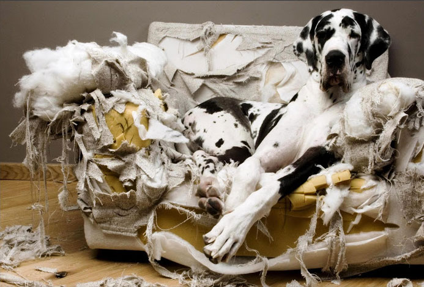

## 1. O Problema de 10 Horas Sozinho

Nós humanizamos nossos cães. Damos a eles camas confortáveis, roupas, ração premium e muito amor. Mas esquecemos de uma coisa fundamental: **eles ainda são cães**.

!!! info "Fato Biológico"
    Apesar de milênios de domesticação, o cérebro do *Canis lupus familiaris* ainda é o de um **predador-oportunista**. Eles são programados por 40.000 anos de evolução para uma vida de atividade: farejar, rastrear, perseguir, “caçar”, rasgar e roer.

E o que nós oferecemos em troca? Um apartamento silencioso por 10 horas, uma tigela de comida que é esvaziada em 30 segundos e um passeio de 20 minutos na mesma calçada de sempre.

Não é surpresa que eles desenvolvam o que chamamos de “problemas de comportamento”.

!!! warning "Cuidado: Interpretação Errada"
    Um cão que destrói o sofá não está se “vingando” porque você saiu. Ele está, na verdade, gritando: **“Estou entediado e preciso de um trabalho!”**

A solução para isso tem um nome técnico, mas uma aplicação muito prática: **Enriquecimento Ambiental (EA)**.

---

## 2. O “Porque”: A Ciência por Trás do Conceito

> "O problema não é o seu cão. É o tédio."

Para entender por que o Enriquecimento Ambiental funciona, precisamos olhar para os zoológicos da década de 70.

Os tratadores tinham um problema sério: ursos que andavam em círculos o dia todo, macacos que balançavam sem parar, tigres que lambiam as próprias patas até sangrar.

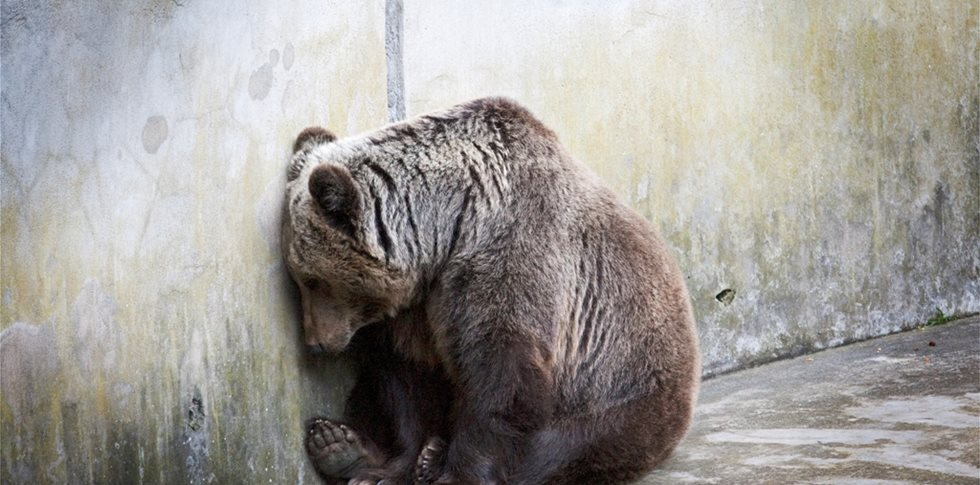

Isso não era “loucura”. Era tédio. Mesmo com comida e segurança, faltava uma coisa: **desafios**. O cérebro desses animais estava “desligado”, e isso gerava um estresse profundo. A solução foi o Enriquecimento Ambiental: esconder a comida, adicionar troncos para escalar, criar problemas para serem resolvidos. Os comportamentos repetitivos (chamados de **estereotipias**) pararam.

### Seu cão é um lobo de apartamento

Pense no seu cão como um supercomputador projetado para “caçar”, rodando em um quarto escuro. A domesticação não apagou seus instintos básicos. A ciência chama isso de **etograma**: o “manual de instruções” de uma espécie.

Esse conflito é a fonte de quase todos os “problemas de comportamento”:

| O Etograma Diz (Instinto) | A Vida Moderna Diz (Realidade) |
| :--- | :--- |
| Fareje o mundo | Fique no sofá por 10 horas |
| Procure sua comida | Coma em 30 segundos na tigela |
| Persiga coisas | Passeio curto na guia |
| Rasgue carcaças | Não destrua nada |

O cão que destrói o sofá não está sendo “mau”. Ele está tentando, desesperadamente, cumprir seu etograma (o instinto de “rasgar”).

!!! quote "Henzel, 2014"
    O enriquecimento ambiental funciona porque ele finalmente dá ao cão um “trabalho” que faz sentido para o seu cérebro.

### Cansar o cérebro > Cansar o corpo

Este é o conceito mais importante. O cérebro é o órgão que mais consome energia no corpo. Atividades que exigem foco, tomada de decisão e processamento de informações (como resolver um quebra-cabeça) são metabolicamente caras.

| Exercício Físico | Exercício Mental |
| :--- | :--- |
| Cansa os **músculos** | Cansa o **cérebro** |
| Caminhada de 5km | Treino de faro de 15 min |
| Cão bebe água e volta a pular | Cão relaxa e dorme |
| Baixo custo metabólico relativo | Alto custo metabólico (foco) |

### O Superpoder: O Faro

O sentido número um do cão é o olfato.

| Humano | Cão |
| :--- | :--- |
| Dominado pela **Visão** | Dominado pelo **Olfato** |
| Vê o mundo | Processa dados químicos (Quem, quando, o quê) |
| Leitura visual | "Leitura" olfativa complexa |

Quando seu cão passa cinco minutos cheirando um poste, ele não está “sendo teimoso”. Ele está processando uma quantidade absurda de dados. É o equivalente a lermos um capítulo de um livro complexo.

Quando usamos o Enriquecimento Ambiental (como um tapete de fuçar), não estamos “dando um petisco”. Estamos ativando a parte mais poderosa do cérebro dele.

---

## 3. O “Como”: Os 5 Pilares do Enriquecimento Ambiental

Enriquecimento não é uma coisa só. É um “cardápio” de atividades que devem cobrir todas as necessidades instintivas do cão. A ciência comportamental (Henzel, 2014) divide o EA em cinco categorias principais.

### 3.1. Pilar Alimentar: O Fim do Desemprego Canino

A tigela de comida é a maior causa de “desemprego” no mundo canino.

Pense bem: o cão é um animal programado para passar horas do seu dia procurando, farejando e “resolvendo” como comer. Nós pegamos esse engenheiro biológico e o substituímos por uma tigela que é esvaziada em 30 segundos.

!!! info "Fato Biológico: Contra-freeloading"
    A maioria dos animais, incluindo cães, quando tem a opção de comer de graça em uma tigela OU fazer um pequeno esforço para conseguir a mesma comida, eles **preferem trabalhar pelo alimento**. O ato de procurar (a caça, o desafio) é, em si, uma recompensa. (Inglis, 1997).

**Como aplicar:** Aposente a tigela. Cada refeição é uma oportunidade.

*   **O Clássico (Kong):** Recheie o brinquedo com a ração (misturada com algo pastoso e seguro, como iogurte natural) e congele.
    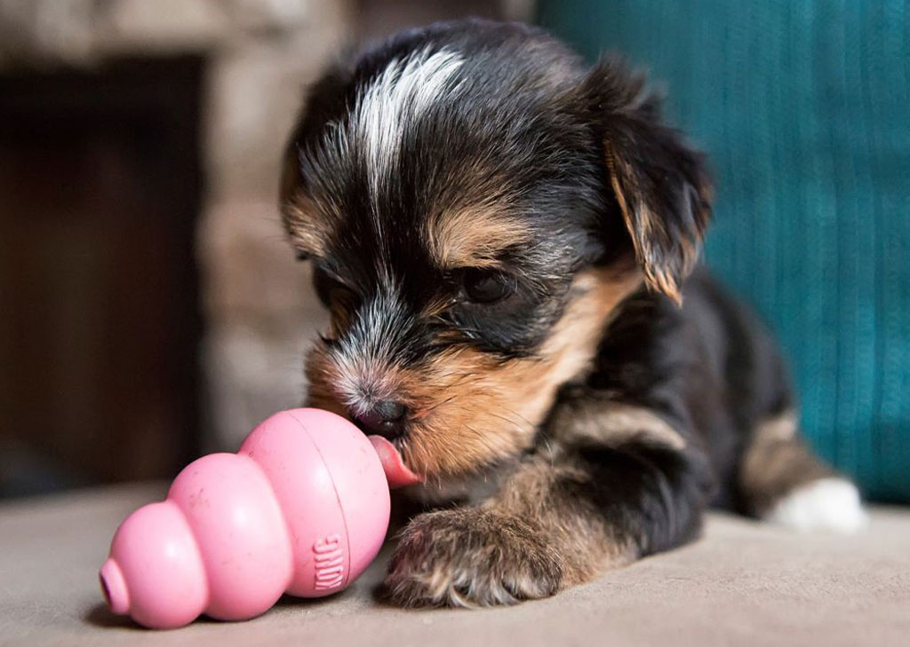

*   **O Farejador (Tapetes de Fuçar):** Esconda a ração seca em um “tapete de fuçar” (*snuffle mat*). Isso ativa o olfato, que é a atividade cerebral número um do cão.
    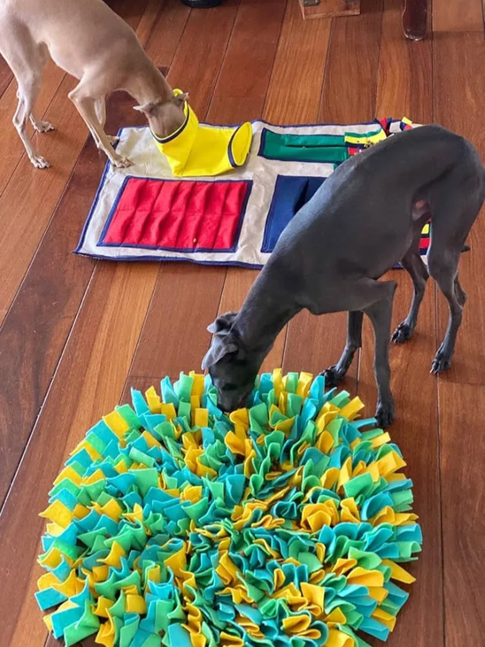

*   **O Desafio (Dispositivos “Slow Feed”):** Use comedouros-labirinto. Estudos como o de Ramos (2020) confirmam que aumentar o tempo de alimentação melhora o bem-estar.
    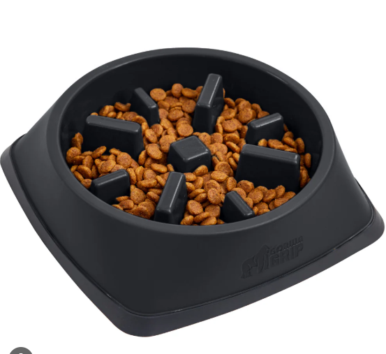

### 3.2. Pilar Sensorial: O Cão Precisa Ler o “Jornal”

Nós, humanos, somos visuais. Cães são olfativos. O cérebro deles é dominado pelo bulbo olfativo, que é (proporcionalmente) 40 vezes maior que o nosso. Enquanto nós vemos o mundo, eles o cheiram em 3D.

!!! tip "Dica do Especialista: A Analogia do Jornal"
    Puxar o seu cão com a guia porque ele parou para cheirar um poste é o exato equivalente a alguém arrancar o celular da sua mão enquanto você está lendo uma notícia importante. O poste é o “jornal do bairro”.

Permitir que o cão fareje livremente diminui a frequência cardíaca e os níveis de **cortisol** (estresse). É uma atividade naturalmente calmante (Burn, 2017).

**Como aplicar:**

*   **O “Passeio de Faro” (Sniffari):** Pelo menos algumas vezes por semana, use uma guia longa (3–5 metros) e deixe o cão ditar o caminho e o ritmo.
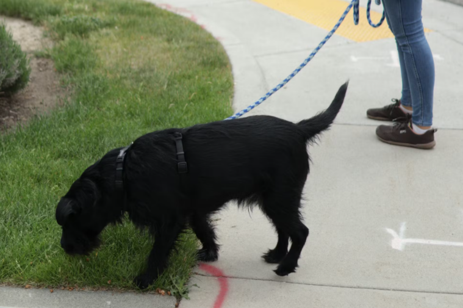
*   **O Delivery de Cheiros:** Traga coisas novas para dentro de casa. Uma caixa de papelão da rua, folhas secas do parque, um pedaço de casca de árvore.
    

### 3.3. Pilar Cognitivo: A Academia para o Cérebro

Este pilar é sobre **resolução de problemas**. Muitos cães, especialmente de raças de trabalho (Border Collies, Pastores, Poodles), foram selecionados geneticamente para... pensar.

!!! danger "Cuidado"
    Quando não damos problemas para eles resolverem, eles mesmos inventam problemas. E geralmente as soluções envolvem seus dentes e o pé da sua cadeira favorita.

Assim como nós, os cães sentem o “Efeito Eureka!”. Pesquisas mostram que cães que resolvem um problema sozinhos ficam visivelmente mais “felizes” e otimistas (McGowan, 2014).

**Como aplicar:**

*   **Os Puzzles (Tabuleiros):** Invista em jogos onde o cão precisa deslizar peças ou levantar pinos para achar um petisco.
    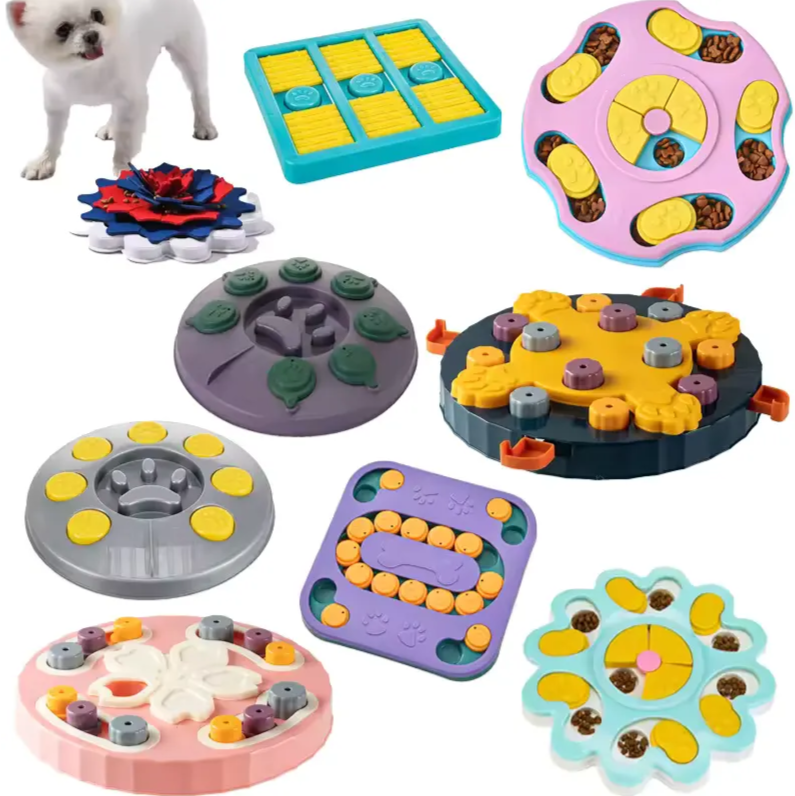

*   **O Básico (Treinamento):** 10 minutos por dia ensinando “senta”, “rola” ou “toca a pata” é um exercício mental intenso.
    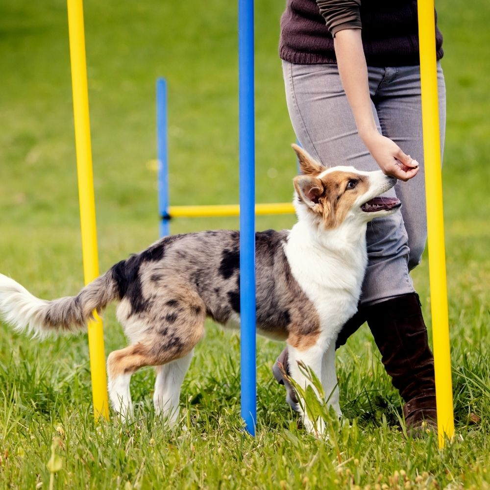

*   **O Jogo dos Copinhos:** O clássico “cadê a bolinha?”. Esconda um petisco sob um de três copos e deixe-o usar o faro para acertar.

### 3.4. Pilar Físico: O Prazer de Destruir (a Coisa Certa)

Este é um dos instintos menos compreendidos. Parte do etograma de um predador é rasgar e dissecar a carcaça. Cães têm uma necessidade física de usar os dentes e as patas para rasgar coisas.

!!! info "Fato Biológico"
    Não é “raiva”, é um comportamento natural de forrageamento e consumo. Roer também é comprovadamente uma atividade auto-calmante que libera **endorfinas**, ajudando a aliviar o estresse. (ASPCA).

**Como aplicar:**

*   **O Herói do EA (Caixa de Papelão):** O melhor brinquedo e o mais barato. Entregue uma caixa de papelão (sem grampos ou fita) e deixe o cão destruí-la.
    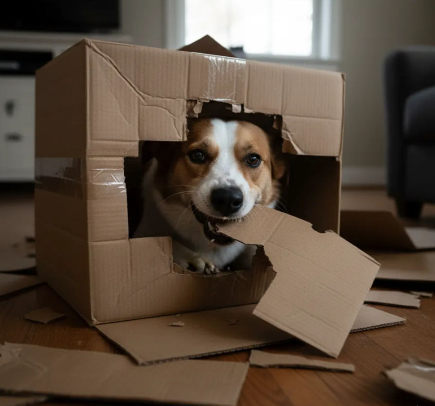

*   **Os Naturais:** Roer coisas como casca de coco verde ou madeira de café (própria para cães) satisfaz o instinto de “descascar”.
    

*   **A Caixa de Cavar:** Se seu cão ama cavar, crie uma “caixa de areia” e enterre brinquedos lá.
    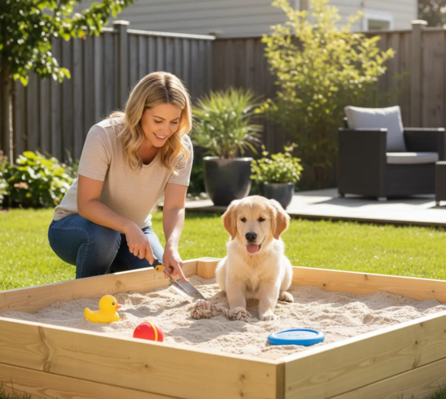

### 3.5. Pilar Social: Qualidade é Melhor que Quantidade

Cães são animais sociais, mas “socialização” é uma palavra mal interpretada. Não significa jogar seu cão em um parque lotado. Enriquecimento social significa **interação de qualidade**.

!!! tip "Analogia"
    Deixar o cão no mesmo sofá que você, enquanto você mexe no celular, não é interação. É a diferença entre estar em um elevador lotado (presença) e estar em um jantar com um bom amigo (interação).

O engajamento do tutor na brincadeira é fundamental para o relacionamento (Horváth, 2008).

**Como aplicar:**

*   **O Vínculo (Brincadeira Estruturada):** Cabo de guerra é excelente (com regras).
    
*   **O “Manejo” (Treino):** As sessões de treino também são EA Social.
    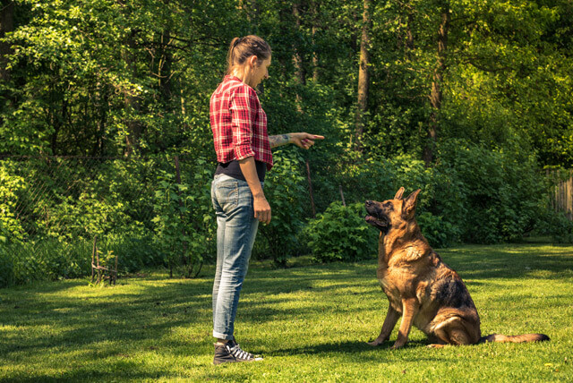
*   **A Observação:** Sentar em um banco de praça e deixar o cão observar o mundo calmamente.
    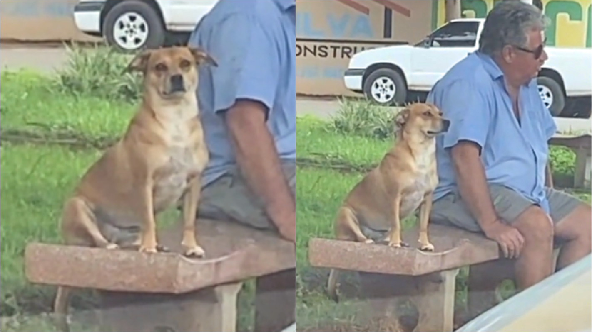

---

## 4. Conclusão: Mais que “Cansado”, um Cão Realizado

É hora de aposentar um dos clichês mais repetidos no mundo canino: a ideia de que “um cão cansado é um cão feliz”. **Um cão exausto é apenas... exausto.**

O verdadeiro oposto do tédio e da ansiedade não é o cansaço. É o **propósito**.

O Enriquecimento Ambiental oferece ao cérebro canino a chance de fazer exatamente aquilo para o qual ele foi projetado:

1.  Farejar o mundo;
2.  Resolver problemas para comer;
3.  Usar os dentes para rasgar e roer;
4.  Usar o corpo para explorar.

O Enriquecimento Ambiental não é um “extra”, um luxo ou um “mimo”. É uma necessidade biológica fundamental, tão essencial para a saúde mental do cão quanto a água é para a sua saúde física.

Comece simples: troque a tigela pelo Kong. Troque a pressa pelo faro. Ao fazer isso, você não estará apenas “cansando” seu cão. Você estará, finalmente, dando a ele a chance de ser um cão.

---

## 5. Referências (Para Aprofundar)

*   **RAMOS (2020)**. Impacto do enriquecimento ambiental sobre o comportamento de cães e digestibilidade da dieta em canil experimental.
*   **HENZEL (2014)**. O enriquecimento ambiental no bem-estar de cães e gatos. *Monografia UFRGS*.
*   **INGLIS et al. (1997)**. Contra-freeloading in domestic dogs.
*   **BURN et al. (2017)**. Best-practice scent-work for kennelled dogs.
*   **MCGOWAN et al. (2014)**. Positive affect and learning: exploring the ‘Eureka effect’ in dogs.
*   **ASPCA**. Destructive Chewing.
*   **HORVÁTH et al. (2008)**. A new perspective on human-dog play.
