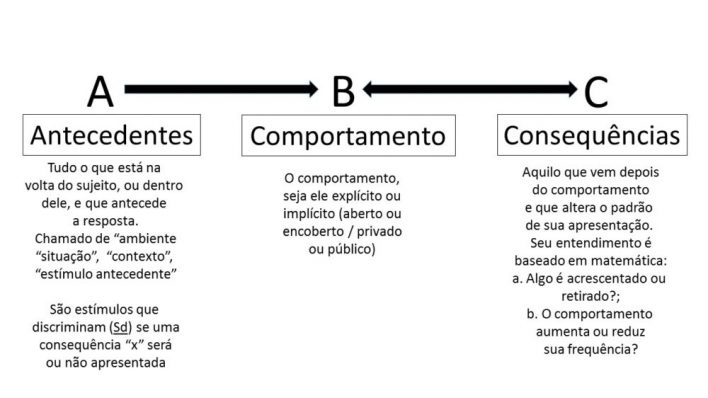

# O Cérebro em Pânico: A Ciência (e a Estupidez) por trás do Tratamento de Medos em Cães

_Por que a exposição forçada (Flooding) quebra a mente do seu cão, e como a Dessensibilização Sistemática reprograma a amígdala cerebral._

## 1. O Mito do “Ele tem que enfrentar”: A falácia de curar trauma com terror

Imagine que você sofre de acrofobia (um pavor incontrolável de altura). Aquele medo visceral que faz suas mãos suarem e suas pernas travarem só de subir num banquinho. Agora, imagine que eu, seu autoproclamado “terapeuta comportamental”, decido que a cura definitiva é te pendurar pelos tornozelos no 20º andar de um arranha-céu até você “perceber que não caiu” e “acostumar com a vista”.

Soa como tortura? Soa ridículo? Pois é. Mas é exatamente isso que milhares de tutores fazem com seus cães todos os dias sob o pretexto de “socialização” ou “adestramento raiz”.

Existe uma crença popular — quase uma lenda urbana — de que o medo é uma frescura, uma “falha de caráter” do animal. Baseado nessa lógica de boteco, arrastam o cão para o meio da queima de fogos, forçam a interação com cães agressivos ou o obrigam a ser tocado por estranhos.

!!! info "Fato Neurobiológico: O Sequestro da Amígdala"
    Quando seu cão entra em pânico, o cérebro dele é literalmente sequestrado. Veja os bastidores:
    
    1.  **A Amígdala** (o botão de pânico) dispara o alarme.
    2.  O corpo é inundado por **Cortisol** e **Adrenalina**.
    3.  O **Córtex Pré-Frontal** (raciocínio e lógica) é temporariamente **desligado**.

Ou seja, exigir que um cão “aprenda” enquanto está aterrorizado é fisiologicamente impossível. É como pedir para alguém resolver uma equação de segundo grau enquanto foge de um leão.

---

## 2. A Lente da Ciência: A Análise Funcional

Comportamento não é mágica; é matemática biológica. Nós não “consertamos” o cachorro; nós consertamos o ambiente onde o cachorro vive.

Para fazer isso, utilizamos a **Análise Funcional** (ou Tríplice Contingência), derivada dos estudos de B.F. Skinner.

!!! quote "B.F. Skinner"
    O comportamento é selecionado por suas consequências.

### O Código Fonte: A — B — C

*   **A — Antecedentes (O Gatilho):** O que acontece antes. O som da chave, a visita, o trovão. O "A" avisa ao cérebro que uma oportunidade de reforço ou punição está disponível.
*   **B — Resposta (A Ação):** O que o cão faz. Late, esconde, morde. O amador foca aqui; o profissional sabe que isso é só o sintoma.
*   **C — Consequências (O Resultado):** O que acontece depois. Se o comportamento continua, é porque está sendo reforçado.

### O “Pulo do Gato”: Manipulando a Variável A

Aqui está o segredo: **Para tratar o medo, você não ataca o comportamento (B); você manipula o Antecedente (A).**

Exemplo de cenário de medo:
1.  **(A)** Visita estranha entra.
2.  **(B)** Cão foge e se esconde.
3.  **(C)** Visita não toca no cão (segurança).

O cão aprendeu que "se esconder funciona".

!!! tip "A Engenharia do Comportamento"
    O erro é tentar corrigir o B (puxar o cão). A solução é mudar o A: a visita aparece a 10 metros, de costas. Tornamos a fuga desnecessária.

---

## 3. Flooding (A Roleta Russa Emocional)

O **Flooding** (ou Inundação) pega a lógica da Análise Funcional e joga no lixo. Ele bombardeia o animal com o Antecedente mais aversivo possível, impedindo a fuga.

A lógica (torta) é: “Quando ele cansar, ele vai ver que não morreu.”

### O Engodo Visual: “Olha, ele acalmou!”

O problema é que o Flooding é um mentiroso. Você expõe o cão, ele reage, entra em pânico e, de repente... para. Fica imóvel.
O tutor acha que ele "entendeu". A ciência chama isso de **Desamparo Aprendido** (*Learned Helplessness*).

### A Ciência por trás do “Travar”: Martin Seligman

!!! danger "Perigo: Desamparo Aprendido"
    Descoberto por Martin Seligman, o Desamparo Aprendido ocorre quando o animal percebe que **nenhuma ação sua altera o resultado**.
    
    1.  **Hiperestimulação:** Amígdala inunda o sistema de cortisol.
    2.  **Falha na Contingência:** O cão perde a agência.
    3.  **Shutdown:** O corpo congela para economizar energia, mas a frequência cardíaca continua disparada (200+ bpm).

O cão não aprendeu a gostar; ele aprendeu que é impotente. Isso é uma bomba-relógio.

---

## 4. Dessensibilização Sistemática (A Ciência do “Quase Nada”)

Se o Flooding é um martelo, a **Dessensibilização Sistemática (DS)** é um bisturi a laser. Desenvolvida por Joseph Wolpe, baseia-se na **Inibição Recíproca**: é impossível estar relaxado e aterrorizado ao mesmo tempo.

Nós fatiamos o problema em pedaços tão pequenos que o botão de pânico nem chega a ligar.

### O Segredo: O Limiar de Tolerância (Threshold)

Imagine um "Termômetro do Medo" (0 a 100):
*   **0–20:** Relaxado.
*   **20–50:** Alerta.
*   **80–100:** Pânico (Zona do Flooding).

A mágica acontece na faixa **20 a 40**. O cão nota o estímulo, mas não reage negativamente.

### A Equação do Sucesso: DS + CC

Para blindar a mente, usamos a fórmula:

> **(Antecedente Baixo) + (Comida Deliciosa) = Nova Emoção**

1.  **Dessensibilização (DS):** O "monstro" aparece a 50 metros.
2.  **Contracondicionamento (CC):** Imediatamente, chove frango ou brinquedo.

O cérebro muda a previsão: de "perigo iminente" para "jantar chegando".

---

## 5. Batalha Prática: O Preço do “Caminho Mais Curto”

Muitos vendem o Flooding porque parece rápido. A Dessensibilização parece lenta. Mas na biologia, rápido quase sempre significa caro.

| Critério | Flooding (Inundação) | Dessensibilização Sistemática |
| :--- | :--- | :--- |
| **Definição** | Exposição intensa e inescapável ao estímulo aversivo (medo) até que a reação de fuga cesse. | Exposição gradual e controlada ao estímulo, sempre abaixo do limiar de medo. |
| **Mecanismo** | Extinção forçada. Tenta "quebrar" a resposta de medo pela exaustão. | Habituação + Contracondicionamento. Substitui o medo por uma emoção positiva. |
| **O que o cão sente** | Pânico, impotência, terror. | Curiosidade, calma, expectativa de recompensa. |
| **O que acontece no cérebro** | **Sequestro da Amígdala**. O córtex pré-frontal (raciocínio) desliga. Alta liberação de cortisol. | **Córtex ativo**. O cão continua pensando e aprendendo. Baixo estresse. |
| **Risco de Trauma** | Altíssimo. Pode gerar **Sensibilização** (o medo piora) ou Agressividade. | Quase zero. O treino para se o cão mostrar desconforto. |
| **Resultado Comum** | **Desamparo Aprendido**. O cão "trava" por fora, mas continua em pânico por dentro. | **Confiança real**. O cão aprende que é capaz de lidar com a situação. |
| **Tempo de "Cura"** | Curto prazo (parece funcionar em minutos, mas geralmente falha depois). | Longo prazo (demora semanas/meses, mas é definitivo). |

### Por que a pressa é inimiga da perfeição?

O Flooding ignora a precisão. Se der errado, você não volta para o zero; volta para o -10. Um cão pode passar a ter medo de luzes, barulhos e **de você**.

A Dessensibilização é a única que constrói uma fundação sólida onde o medo é substituído por confiança.

---

## 6. Conclusão: Seja o Engenheiro, Não o Carrasco

Amor não é suficiente. É preciso competência.

A maioria traumatiza por ignorância, acreditando no mito heroico do enfrentamento. Mas a biologia responde a estímulos, não a heroísmo.
Tentar arrancar a defesa do cão na marra é como consertar um computador com uma marreta.

!!! success "O Caminho da Inteligência"
    A Dessensibilização Sistemática é engenharia comportamental. Exige paciência, manipulação do ambiente e fatiar o problema. Mas é a única forma de reescrever a história emocional do seu cão.
    
    Seja o porto seguro que ele precisa, não a fonte do trauma que ele teme.

---

## 7. Referências Bibliográficas

1.  **Universidade Cão (Ernesto Uszko)**. Material Didático: Análise Funcional.
2.  **Skinner, B.F. (1938)**. *The Behavior of Organisms*. (Comportamento selecionado por consequências).
3.  **Wolpe, J. (1958)**. *Psychotherapy by Reciprocal Inhibition*. (Dessensibilização Sistemática).
4.  **Seligman, M. E. P. (1972)**. *Learned Helplessness*. (Desamparo Aprendido).
5.  **Ramirez, K. (1999)**. *Animal Training*. (Reforço positivo em ambientes complexos).
6.  **Lindsay, S. R. (2000)**. *Handbook of Applied Dog Behavior*. (Riscos de métodos aversivos).
